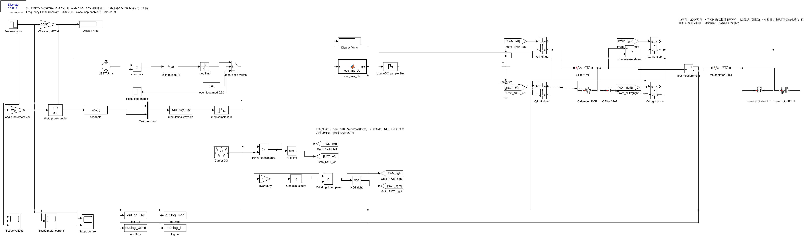
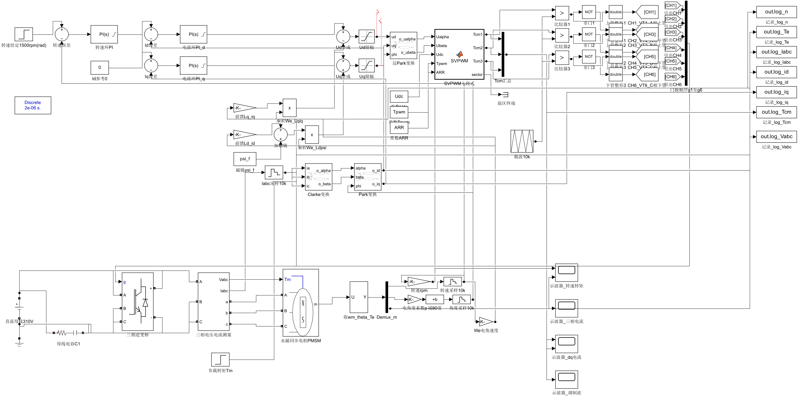

# Simulink 黑库电力电子 Skill

**[English](README_EN.md) | 简体中文**

> 一套完全从 10 个真实可运行的 Simulink 模型反推出来的电力电子建模规范，专为 **Simscape Electrical 特高压库（Specialized Power Systems，俗称"黑库"——库里那批黑色图标模块）** 而写，也可以作为 AI Agent（如 Claude / WorkBuddy 等）搭建仿真时的 skill 使用。


*用本规范搭建的单相 SPWM 逆变模型实例*


*用本规范搭建的三相 PMSM FOC 模型实例（SPS 永磁同步电机模块 + SVPWM）*

## 为什么叫"黑库"

在 Simulink 库浏览器里，**Simscape Electrical → Specialized Power Systems（SPS）** 下的电气元件全部是黑色图标的模块——`powergui`、`Mosfet`、`IGBT//Diode`、`Series RLC Branch`……与 Simulink 基础库的浅色模块一眼就能区分。本规范的主电路**只用这一套"黑库"**，控制部分只用 Simulink 基础库，10 个源模型 100% 如此，是铁律。

## 这是什么

这不是一份"教科书式最佳实践"，而是一份**实测规范（playbook）**：

- 每条规则都标注了出处模型（匿名代号），参数全部来自真实模型的掩码实测值，不是拍脑袋
- 覆盖：固定建模七步流程、手搭载波比较 PWM、PI 双环参数实测表、7 段式 SVPWM 完整代码、Clarke/Park 变换模板、准 PR 控制器调参经验、求解器/采样时间配置、命名约定、安全底线
- 特别适合让 AI Agent 生成"风格统一、参数可信"的电力电子仿真模型

## 覆盖的拓扑

| 拓扑 | 代号 | 要点 |
|---|---|---|
| DC-DC 功率/频率扫描平台 | SCAN | 100kHz 快环、手写 PI + 前馈、测试信号生成 |
| 三相两电平逆变器 | INV-3P | PI 双环 + dq 解耦 + SVPWM |
| 三相 Boost PFC 整流 | PFC-3P | IGBT 三相桥、50e-9 控制采样 |
| 单相 4 管 PFC | PFC-1P-A/B | 双极性调制、uin 前馈、PLL |
| AC-AC Buck-Boost | BB-A/B | 开环占空比、PWM Generator (DC-DC) |
| 准 PR 电流环试验台 | PFC-PR | Tustin 离散 PR + 抗饱和 + 前馈经验 |
| 早期教学模型 | EDU | 晶闸管、唯一的 Continuous 例外 |

## 快速开始

### 作为 AI Agent skill 使用（推荐）

把整个目录复制到你的 agent 技能目录，例如 WorkBuddy：

```
~/.workbuddy/skills/power-simulink-rule/
```

之后当你要求 agent "搭一个 PFC 仿真 / 逆变模型 / Buck-Boost"时，它会自动按本规范执行。Claude Code / 其他支持 SKILL.md 格式的工具同理。

### 人工阅读使用

按这个顺序读：

1. [`SKILL.md`](SKILL.md) —— 核心规则速览（建模七步、控制模板、命名、参数、安全底线）
2. [`references/rules.md`](references/rules.md) —— 详细规范，每条标注出处
3. [`references/library-guide.md`](references/library-guide.md) —— 黑库 + 基础库的完整模块清单与禁用清单
4. [`references/models-analysis.md`](references/models-analysis.md) —— 10 个模型的逐模型实测依据（规则的证据链）

配套脚本 [`scripts/extract_model_params.m`](scripts/extract_model_params.m) 可提取任意 Simulink 模型的求解器/掩码参数，用于给自己现有模型做"体检"：

```matlab
>> extract_model_params('your_model_name')
```

## 规则速览（20 秒版）

- **powergui 第一件事放，必须 Discrete**（SampleTime 1e-7~50e-7）
- 主电路只用 SPS 黑库，控制只用 Simulink 基础库，别的不碰
- PWM 优先手搭载波比较：`Repeating Sequence` 载波（幅值 = MCU ARR，如 7200）+ `Relational Operator(>)` + `NOT` 互补
- PI 一律 `PID Controller`（PI/Parallel/Forward Euler/N=100），内环显式采样、外环 -1 继承
- 参数写表达式不写死数值：`24*sqrt(2)`、`1/20000`、`2e-3*2*pi*50`
- duty 限幅 [0.02, 0.98]，控制量必须 `Saturate`
- 电流采样用毫欧电阻（1e-5~1e-7）+ 隔离测量
- 注释用中文口语，解释"为什么"

## ⚠️ 诚实声明

**本 skill 由作者个人实战使用沉淀而来，仅经过个人日常使用的检验，没有做过系统化的测试与验证。**

- 作者自己用起来非常顺手，尤其是**控制过程（PI/PWM/SVPWM/PR 部分）质量很高**
- 已知缺点：**模型布线/连线可能比较乱**（大量使用 From/Goto 分发信号，走线不追求美观），强迫症慎入
- 实测参数来自作者自己的项目（电压等级、功率等级未必匹配你的场景），照抄前请先按你的电路自行核算
- 单相 PFC 的一个源模型（PFC-1P-A）本身仿真会发散，规范里已如实标注"仅参考结构"

## 适用环境

- MATLAB R2024b（其他版本大概率可用，未逐一验证；`DiscreteIntegrator` 参数名在老版本为 `GainValue`）
- 作为 skill 使用时，需要一个能操作 MATLAB/Simulink 的 agent 环境（如 MATLAB MCP）

## 目录结构

```
power-simulink-rule/
├── SKILL.md                        # 核心规范（agent 入口）
├── references/
│   ├── rules.md                    # 详细规则（每条标注出处代号）
│   ├── library-guide.md            # 库选用清单 + 合规检查代码
│   └── models-analysis.md          # 10 个模型的实测依据（匿名代号）
├── scripts/
│   └── extract_model_params.m      # 模型参数提取工具
├── docs/images/                    # 实例模型截图
├── LICENSE                         # MIT
├── README.md                       # 中文说明（本文件）
└── README_EN.md                    # English readme
```

## License

[MIT](LICENSE) © 1841220388zzzcccxxx-star
